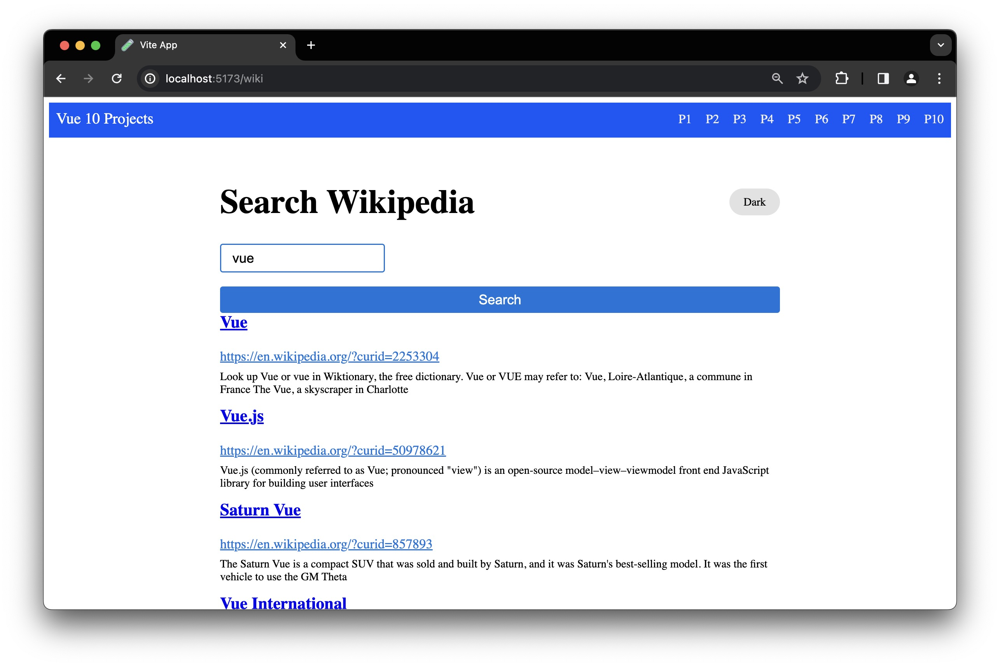

# Vue.js Mini-Apps Collection

Welcome to my Vue.js Mini-Apps Collection! This repository contains a series of small web applications developed while learning Vue.js. Each mini-app showcases different features and functionalities of Vue.js and aims to demonstrate its versatility and ease of use.

## Technologies Used

- Vue.js
- HTML
- CSS
- JavaScript
- Axios

## Screenshots

